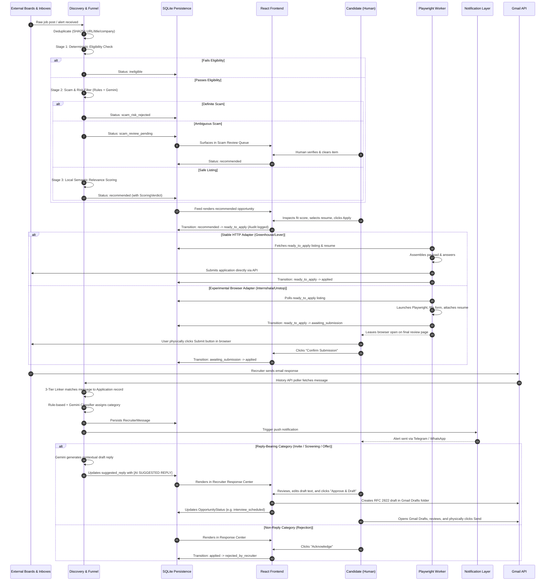
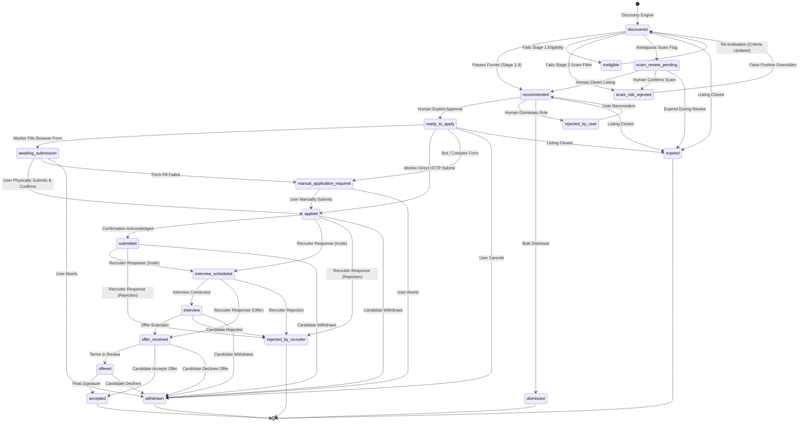
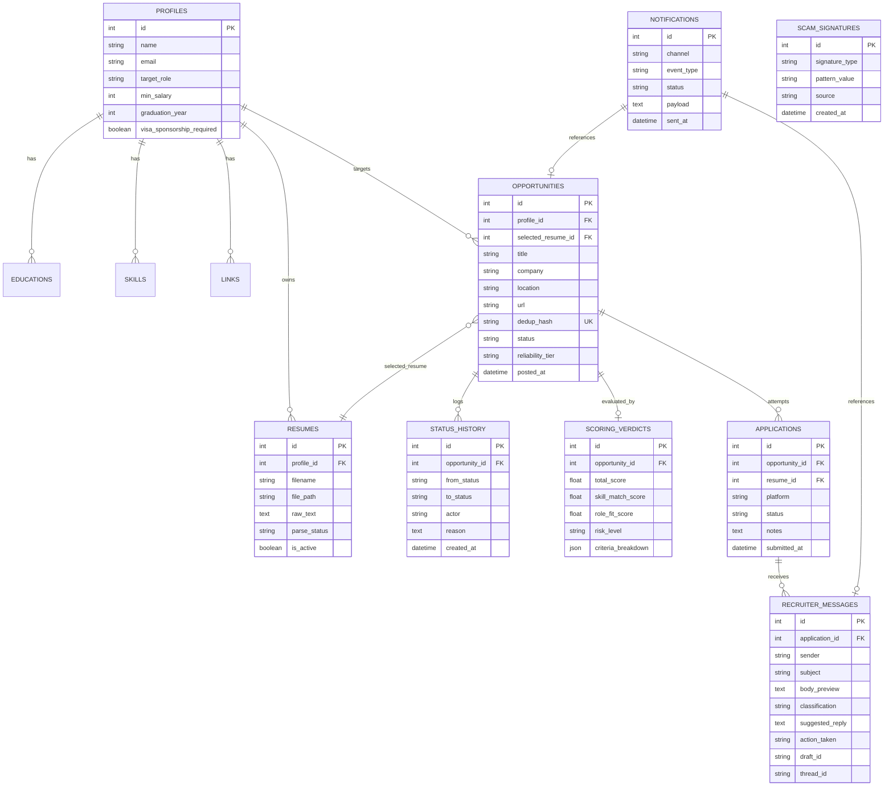
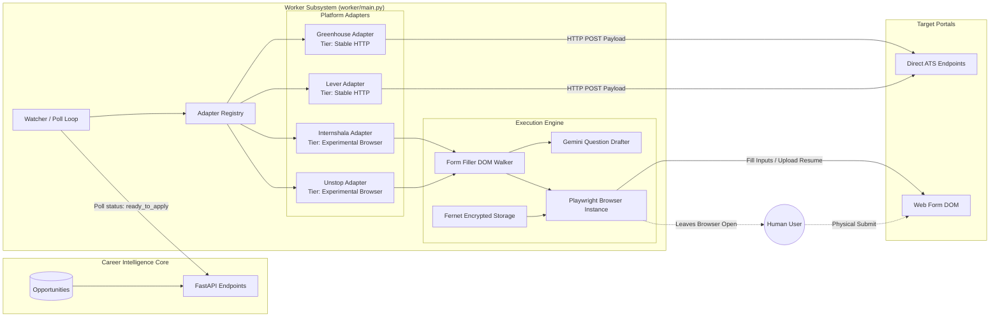

# Comprehensive Architectural Reconstruction & System Status (Phases 1–10)
**Project**: Job Application Agent / Career Intelligence Core  
**Current State**: Post-Phase 10 Implementation & Verification  
**Repository**: `c:\Users\kusha\OneDrive\Desktop\AI-AGent\job-app-agent`  
**Database Revision**: Alembic `0008` (Head)  
**Test Coverage**: 452 Backend Tests (100% Pass) | 13 Frontend Unit Tests (100% Pass) | Production Build Clean (718ms)

---

## 1. Executive Summary

### 1.1 What the System Does
The **Job Application Agent** (powered by the **Career Intelligence Core**) is an autonomous yet human-governed job search, application preparation, and communication lifecycle system. It continuously discovers prospective job and internship opportunities across public job boards, company career portals, ATS platforms (Greenhouse, Lever), RSS job feeds, and Gmail alerts. It normalizes and deduplicates listings, executes a multi-stage qualification and risk funnel (deterministic eligibility, deterministic + LLM scam filtering, and local semantic relevance scoring), recommends high-fit roles to the candidate, prepares tailored application packages (custom answers, selected resumes), operates a standalone browser automation worker to fill complex applications, and monitors incoming recruiter communications to draft contextual replies and track application progress.

### 1.2 Primary Purpose
The primary purpose of the system is to **drastically compress the high-friction, repetitive overhead of job hunting while eliminating candidate vulnerability to spam, ghost postings, and recruitment fraud**. It is engineered to remove typing, form filling, and repetitive scanning without forfeiting human judgment, candidate authenticity, or ethical compliance.

### 1.3 Current Maturity and Status
The system has completed **Phases 1 through 10** of its defined 12-phase roadmap:
- **Phases 1–8 (Complete MVP)**: Profile and resume management, tracking database and status engine, multi-source discovery, 3-stage qualification funnel, human approval dashboard, Gmail monitoring, and cross-channel push notifications (Telegram & WhatsApp/Infobip).
- **Phase 9 (Browser Automation Worker)**: Isolated Playwright-based automation process for pre-filling application portals, handling custom questions with visibly marked AI drafts, and managing encrypted session cookies.
- **Phase 10 (Recruiter Response Loop)**: End-to-end recruiter communication workflow featuring Gemini-powered suggested reply drafting, strict Gmail draft creation (zero programmatic send capability), and human-authorized status synchronization.
- **Overall Maturity**: Highly mature, fully tested, production-ready core architecture with strict fail-closed safety boundaries.

### 1.4 Overall Automation Philosophy
The architecture is strictly governed by a core invariant:
> **Automation may discover, classify, score, prepare, pre-fill, and recommend. All consequential external actions (submitting an application, transmitting an email, or clearing an ambiguous scam) require explicit, out-of-band human authorization.**

The system treats AI as an assistant, never an unsupervised proxy. It enforces a structural **fail-closed** design: if an AI model is unavailable, quota is exhausted, parsing yields insufficient text, or an ATS form exhibits unexpected CAPTCHAs, the system stops, preserves state, and safely surfaces the task to the human.

---

## 2. High-Level System Architecture

The system is organized into modular layers with strictly enforced boundaries between the asynchronous Career Intelligence Core and the decoupled Browser Automation Worker.

```mermaid
flowchart TB
    subgraph ExternalSources["External Sources & Services"]
        GH[Greenhouse API]
        LEV[Lever API]
        RSS[RSS Job Feeds]
        GMAIL_IN[Gmail History API]
        GEMINI[Google Gemini API]
        TG_API[Telegram Bot API]
        WA_API[Infobip WhatsApp API]
        ATS_PORTALS[Target Portals: Greenhouse/Lever/Internshala/Unstop]
    end

    subgraph CoreLayer["Career Intelligence Core (FastAPI Backend)"]
        subgraph DiscoverySub["Discovery Engine"]
            SCHED[APScheduler]
            DISC_PIPE[Discovery Pipeline]
            ADAPT_GH[Greenhouse Adapter]
            ADAPT_LEV[Lever Adapter]
            ADAPT_RSS[RSS Adapter]
            ADAPT_GMAIL[Gmail Alerts Adapter]
        end

        subgraph FunnelSub["Evaluation & Qualification Funnel"]
            STAGE1[Stage 1: Eligibility Rules Engine]
            STAGE2[Stage 2: Scam & Risk Engine<br/>Rules + Gemini LLM]
            STAGE3[Stage 3: Relevance Scorer<br/>Local sentence-transformers]
        end

        subgraph ServiceSub["Core Services & Status Engine"]
            OPP_SVC[Opportunity & Status Service]
            PROF_SVC[Profile & Resume Service]
            NOTIF_SVC[Notification Service]
            RESP_SVC[Response Loop Service]
            DRAFT_SVC[Gmail Draft Service]
            REPLY_DRAFT[Gemini Reply Drafter]
        end

        subgraph DataLayer["Persistence Layer (SQLite + WAL / SQLAlchemy)"]
            DB[(job_agent.db)]
            REPO[Repositories: Profile, Resume, Opportunity,<br/>Application, Scoring, Messages, Notifications]
        end
    end

    subgraph WorkerLayer["Browser Automation Worker (Isolated Process)"]
        WORKER_RUN[Worker Runner & Registry]
        WORKER_FILL[Form Filler Engine]
        WORKER_DRA[Question Drafter]
        WORKER_SEC[Encrypted Session Storage]
        PW[Playwright Browser Automation]
    end

    subgraph FrontendLayer["Candidate Interface (React 19 + Vite + TypeScript)"]
        DASH[Opportunity Feed & Approval Modal]
        SCAM_UI[Scam Review Queue]
        RESP_UI[Recruiter Response Center]
        NOTIF_UI[Notification Settings]
    end

    subgraph HumanCandidate["Candidate (Human-in-the-Loop)"]
        USER((Candidate User))
    end

    %% Discovery connections
    SCHED --> DISC_PIPE
    DISC_PIPE --> ADAPT_GH & ADAPT_LEV & ADAPT_RSS & ADAPT_GMAIL
    GH -.-> ADAPT_GH
    LEV -.-> ADAPT_LEV
    RSS -.-> ADAPT_RSS
    GMAIL_IN -.-> ADAPT_GMAIL
    DISC_PIPE --> REPO

    %% Funnel connections
    REPO --> STAGE1
    STAGE1 --> STAGE2
    STAGE2 -.->|Ambiguous cases| GEMINI
    STAGE2 --> STAGE3
    STAGE3 --> REPO

    %% Human and Frontend
    REPO <--> FrontendLayer
    FrontendLayer <--> USER
    USER -->|Explicit Approval: ready_to_apply| OPP_SVC
    USER -->|Scam Clear / Reject| OPP_SVC

    %% Worker flow
    OPP_SVC -->|Status: ready_to_apply| WORKER_RUN
    WORKER_RUN --> WORKER_FILL & WORKER_DRA & WORKER_SEC
    WORKER_FILL --> PW
    PW -.-> ATS_PORTALS
    PW -.->|Open Browser / Awaiting Submit| USER
    USER -->|Physical Submit / Confirm| OPP_SVC

    %% Response loop
    GMAIL_IN -.-> RESP_SVC
    RESP_SVC --> REPO
    RESP_SVC --> NOTIF_SVC
    NOTIF_SVC -.-> TG_API & WA_API
    NOTIF_SVC -.-> USER
    RESP_SVC --> REPLY_DRAFT
    REPLY_DRAFT -.-> GEMINI
    REPLY_DRAFT --> RESP_UI
    USER -->|Edit & Approve Draft| RESP_SVC
    RESP_SVC --> DRAFT_SVC
    DRAFT_SVC -.->|Drafts Only / No Send| GMAIL_IN
    USER -.->|Open Gmail & Click Send| GMAIL_IN
```



### 2.1 Major Architectural Components
1. **Core / Backend**: Built with Python 3.14, FastAPI, SQLAlchemy 2.0, and Pydantic v2. Provides RESTful endpoints, transactional integrity, and service orchestration.
2. **Database & Storage**: SQLite running in Write-Ahead Logging (`WAL`) mode with foreign key enforcement, a `busy_timeout` of 5,000 ms to eliminate immediate lock contention between concurrent processes (Core and Worker), and Alembic migration versioning. Stores resumes, profiles, raw postings, audit history, scoring metrics, and messages.
3. **Discovery Engine**: Extensible adapter framework managed by APScheduler. Ingests opportunities from Greenhouse (stable), Lever (stable), RSS feeds (stable), and Gmail alerts (discovery-only).
4. **Qualification Funnel**:
   - *Stage 1 (Eligibility)*: Fast, zero-cost deterministic filtering against location, graduation year, visa sponsorship, and hard exclusions.
   - *Stage 2 (Scam/Risk)*: Deterministic domain and phrase heuristics, followed by Google Gemini 2.5 Flash for ambiguous cases (with strict daily quota controls), and closed-loop signature learning.
   - *Stage 3 (Relevance)*: Fully offline semantic matching using `sentence-transformers/all-MiniLM-L6-v2` generating 384-dimensional cosine embeddings.
5. **Human Approval Gate**: Web interface allowing candidates to review recommended roles, inspect scoring breakdowns, choose tailored resumes, and authorize application preparation.
6. **Browser Automation Worker**: Completely decoupled subpackage (`worker/`) running Playwright in a dedicated process. The Core never imports Playwright; the Worker communicates with the Core purely via REST APIs.
7. **Recruiter Response Ingestion**: Background History-API poller that fetches incoming recruiter emails, links them to application records via a 3-tier heuristic linker, and classifies them into structured intents.
8. **Notification Subsystem**: Multi-channel alert dispatching (Telegram Bot API and Infobip WhatsApp) notifying the candidate of high-match roles and recruiter responses.
9. **Recruiter Response / Reply Loop**: AI-assisted suggested reply generator with mandatory `[AI SUGGESTED REPLY]` labeling, Google Gmail Draft API integration (with structural denial of send permissions), and human-authorized status progression.
10. **Frontend Dashboard**: Single-page application built on React 19, TypeScript, Vite, React Router 7, and Lucide icons, providing intuitive controls for the entire lifecycle.

---

## 3. End-to-End Opportunity & Message Lifecycle



---

## 4. Phase-by-Phase Implementation Status

### Phase 1 — Profile & Resume Management
- **Objective**: Establish structured candidate data, multiple resumes, and reliable text extraction.
- **Components Created**:
  - SQLAlchemy Models: `Profile`, `Education`, `Skill`, `Link`, `Resume`.
  - Parsers: Deterministic PDF (`pypdf`) and DOCX (`python-docx`) extractors.
  - Repositories & Services: `profile_repo`, `resume_repo`, `profile_service`.
- **Key Files**: `core/models/profile.py`, `core/models/resume.py`, `core/parsing/resume_parser.py`, `api/routers/profiles.py`, `api/routers/resumes.py`.
- **Database Migrations**: `0001_initial_profile_resume.py`.
- **Safety Boundary**: **Fail-closed text extraction**. If parsing extracts fewer than 50 characters, `parse_status` is marked as `parse_failed`, preventing corrupt files from proceeding into downstream scoring.
- **Verification**: 40 unit and integration tests verifying parsing, multi-profile isolation, and resume versioning.
- **Current Status**: Complete, robust, production-ready.

### Phase 2 — Opportunity Tracking DB & Status Machine
- **Objective**: Implement the application state engine, tracking models, and transition validation.
- **Components Created**:
  - Core Status Definition: `OpportunityStatus` enum (20 states), `ReliabilityTier`, `ALLOWED_TRANSITIONS` map.
  - SQLAlchemy Models: `Opportunity`, `StatusHistory`, `Application`.
  - Service Layer: `opportunity_service` with `transition_status()`.
- **Key Files**: `core/status.py`, `core/models/opportunity.py`, `core/services/opportunity_service.py`, `api/routers/opportunities.py`.
- **Database Migrations**: `0002_opportunities_status_applications.py`.
- **Safety Boundary**: **Immutable audit trail & transition map**. Direct database mutations of status are blocked; all updates pass through `transition_status`, which records actor, reason, timestamp, and previous state.
- **Verification**: 52 tests verifying valid transitions, blocked illegal transitions, idempotent deduplication hashing, and history logging.
- **Current Status**: Complete, production-ready.

### Phase 3 — Discovery Engine
- **Objective**: Automate job ingestion across heterogeneous sources without triggering anti-scraping blocks.
- **Components Created**:
  - Base Adapter Interface: `BaseDiscoveryAdapter` producing normalized `RawJobPost` schemas.
  - Platform Adapters: `GreenhouseAdapter` (JSON API), `LeverAdapter` (JSON API), `RSSAdapter` (Feedparser for job boards), `GmailAlertsAdapter` (Google OAuth2 History API).
  - Pipeline & Scheduler: `DiscoveryPipeline` with dedup hashing, APScheduler integration.
- **Key Files**: `core/discovery/sources/`, `core/discovery/pipeline.py`, `core/discovery/scheduler.py`, `core/discovery/gmail_client.py`.
- **External Integrations**: Greenhouse public API, Lever public API, RSS XML endpoints, Google Gmail API.
- **Safety Boundary**: **Tier classification**. Sources are tagged `STABLE`, `EXPERIMENTAL`, or `DISCOVERY_ONLY`. Gmail alerts are discovery-only and strictly read-only.
- **Verification**: 63 tests covering source parsing, deduplication, error isolation, and scheduling.
- **Current Status**: Complete, production-ready.

### Phase 4 — Multi-Stage Funnel: Eligibility & Relevance Scoring
- **Objective**: Filter out mismatched roles deterministically and score the rest using local embeddings.
- **Components Created**:
  - Stage 1: Deterministic `EligibilityChecker` (location match, graduation year, visa sponsorship, negative keywords).
  - Stage 3: `RelevanceScorer` using `sentence-transformers/all-MiniLM-L6-v2` generating 384-dimensional cosine similarity embeddings against candidate skills and resume text.
  - Persistence: `ScoringVerdict` model storing detailed sub-scores and criteria breakdown.
- **Key Files**: `core/funnel/eligibility/`, `core/funnel/relevance/`, `core/models/scoring.py`, `core/funnel/runner.py`.
- **Database Migrations**: `0003_scoring_verdicts.py`.
- **Safety Boundary**: Hard eligibility exclusions immediately move opportunities to `ineligible` without incurring AI or compute overhead. Relevance scoring runs 100% locally with zero external API dependencies.
- **Verification**: 45 tests verifying rule matching, embedding calculations, and pipeline coordination.
- **Current Status**: Complete, production-ready.

### Phase 5 — Multi-Stage Funnel: Scam & Risk Filter
- **Objective**: Protect candidates against recruitment fraud, fee-demanding scams, and phishing.
- **Components Created**:
  - Deterministic Rules: Heuristic scanner detecting suspicious domains, fee requests, wire transfers, telegram contact requirements.
  - LLM Fallback: Google Gemini 2.5 Flash analyzer for ambiguous listings.
  - Quota Budgeting: In-memory `GeminiQuotaTracker` enforcing a 1,500 calls/day limit.
  - Closed-Loop Learning: `ScamContentSignature` repository storing SHA256 hashes and domain patterns of verified scams.
- **Key Files**: `core/funnel/scam_risk/`, `core/models/scam_signature.py`, `api/routers/scam_review.py`.
- **Database Migrations**: `0004_scam_risk.py`.
- **Safety Boundary**: **Fail-closed scam isolation**. If Gemini quota is exhausted or an API error occurs during ambiguous evaluation, the listing transitions to `scam_review_pending` (surfaced to human), never auto-cleared.
- **Verification**: 48 tests covering signature matching, Gemini prompt formatting, quota throttling, and human clearing.
- **Current Status**: Complete, production-ready.

### Phase 6 — Human Approval Dashboard
- **Objective**: Provide a clean web interface for the human-in-the-loop approval gate.
- **Components Created**:
  - Single-Page React App: Vite + React 19 + TypeScript + TailwindCSS.
  - Feed & Cards: `OpportunityCard` with match score badges, eligibility flags, and breakdown drawers.
  - Approval Gate: `ApprovalModal` requiring resume selection before approving to `ready_to_apply`.
  - Review Queues: `ScamReviewQueue` for clearing or confirming flagged scam risks.
- **Key Files**: `frontend/src/pages/FeedPage.tsx`, `frontend/src/components/feed/ApprovalModal.tsx`, `frontend/src/components/scam/ScamReviewQueue.tsx`.
- **Database Migrations**: `0005_phase6_approval.py` (added `selected_resume_id` to `opportunities`).
- **Safety Boundary**: Opportunities cannot enter the application worker pipeline without a candidate explicitly selecting an active resume and confirming approval.
- **Verification**: 13 frontend Vitest unit tests; full TypeScript build verification (718ms).
- **Current Status**: Complete, production-ready.

### Phase 7 — Recruiter Response Ingestion & Classification
- **Objective**: Detect incoming recruiter emails, link them to submitted applications, and classify intent.
- **Components Created**:
  - Gmail Poller: `ResponsePoller` using Gmail History API.
  - 3-Tier Linker: Matches emails by explicit Application ID header/subject, company domain matching, and fuzzy recruiter name heuristics.
  - Classifier: Rule-based keyword engine backed by Gemini LLM fallback (`interview_invite`, `screening_question`, `rejection`, `offer`, `follow_up`, `generic`).
- **Key Files**: `core/models/message.py`, `core/messaging/response_poller.py`, `core/messaging/linker.py`, `core/messaging/classifier.py`.
- **Database Migrations**: `0006_recruiter_messages.py`.
- **Safety Boundary**: Ingestion and classification are strictly read-only. A newly received message never autonomously updates opportunity status.
- **Verification**: 58 tests validating linking heuristics, classification edge cases, and token expiration handling.
- **Current Status**: Complete, production-ready.

### Phase 8 — Multi-Channel Notification Layer
- **Objective**: Alert candidates in real time when high-match opportunities or recruiter messages arrive.
- **Components Created**:
  - Notification Service: `NotificationService` coordinating dispatches and logging.
  - Providers: `TelegramProvider` (Telegram Bot API) and `WhatsAppProvider` (Infobip Template API).
  - Persistence: `NotificationLog` and `NotificationSetting` tables.
- **Key Files**: `core/notifications/`, `core/models/notification.py`, `api/routers/notifications.py`.
- **Database Migrations**: `0007_notifications.py`.
- **Safety Boundary**: **Observation only**. Notifications are outbound telemetry; they carry no inbound execution tokens and cannot trigger application submissions.
- **Verification**: 42 tests covering payload formatting, provider failover, quiet hours, and channel toggles.
- **Current Status**: Complete, production-ready.

### Phase 9 — Browser Automation Worker
- **Objective**: Automate form filling across complex ATS platforms while maintaining human oversight.
- **Components Created**:
  - Isolated Process: Separate entry point (`worker/main.py`) running Playwright.
  - Adapters: Stable HTTP (Greenhouse, Lever) and Experimental Browser (Internshala, Unstop).
  - Engines: `FormFiller` DOM walker and `QuestionDrafter` (Gemini-powered custom question answering).
  - Security: Fernet-encrypted browser session storage (`worker/security/storage.py`).
- **Key Files**: `worker/`, `worker/engine/filler.py`, `worker/engine/question_drafter.py`, `worker/adapters/`.
- **Safety Boundary**: **Open-browser human submission**. For browser-automated portals, the worker fills inputs and leaves the browser open on the review screen. The human inspects the form and physically clicks Submit. The worker never autonomously submits. All AI-generated answers carry `[AI DRAFT]`.
- **Verification**: 43 worker tests covering DOM fill failures, duplicate locks, session encryption, and confirmation flows.
- **Current Status**: Complete, production-ready.

### Phase 10 — Recruiter Response Loop
- **Objective**: Complete the communication cycle: Classify → Notify → Suggested Reply → Human Approval → Gmail Draft → Human Send → Status Sync.
- **Components Created**:
  - Reply Drafter: `ReplyDrafter` generating contextual email drafts prefixed with `[AI SUGGESTED REPLY - EDIT BEFORE SENDING]`.
  - Gmail Draft Service: `create_gmail_draft()` using standard RFC 2822 formatting.
  - Response Loop Orchestrator: `response_loop_service` handling approval, draft creation, and status transitions.
  - Frontend: Interactive `ResponseCenterPage` with inline editor and action triggers.
- **Key Files**: `core/messaging/draft_service.py`, `core/messaging/reply_drafter.py`, `core/services/response_loop_service.py`, `api/routers/messages.py`, `frontend/src/components/responses/ResponseCenterPlaceholder.tsx`.
- **Database Migrations**: `0008_phase10_response_loop.py` (added `suggested_reply`, `action_taken`, `draft_id` to `recruiter_messages`).
- **Safety Boundary**: **Structural send impossibility**. The OAuth configuration strictly requests `gmail.readonly` and `gmail.compose`. `gmail.send` is absent. The system can only create drafts; only the candidate can transmit emails. Status transitions require explicit user click.
- **Verification**: 30 comprehensive response loop tests validating draft creation, status transitions, and fallback templates.
- **Current Status**: Complete, production-ready.

---

## 5. Opportunity Status State Machine

The status machine is implemented in `core/status.py` and strictly enforced by `opportunity_service.transition_status()`. Every status change is validated against `ALLOWED_TRANSITIONS` and written to `status_history`.



### 5.1 Status Registry & Transition Rules

| Status | Category | Reachable Transitions | Terminal? | Boundary / Actor |
|---|---|---|---|---|
| `discovered` | Discovery | `recommended`, `ineligible`, `scam_risk_rejected`, `scam_review_pending`, `expired` | No | Automated Funnel |
| `ineligible` | Qualification | `discovered` | No | Return path on criteria change |
| `scam_risk_rejected` | Qualification | `discovered` | No | Return path on false-positive fix |
| `scam_review_pending` | Review | `recommended`, `scam_risk_rejected`, `discovered`, `expired` | No | **Human Gate (Scam Review)** |
| `recommended` | Recommendation | `ready_to_apply`, `rejected_by_user`, `dismissed`, `scam_risk_rejected`, `expired` | No | Automated Funnel |
| `rejected_by_user` | User Action | `recommended` | No | Candidate decision |
| `dismissed` | Archival | *(None)* | **Yes** | Candidate decision |
| `ready_to_apply` | Approval Gate | `awaiting_submission`, `applied`, `manual_application_required`, `expired`, `rejected_by_user`, `withdrawn` | No | **Strict Human Approval Gate** |
| `awaiting_submission` | Worker Stage | `applied`, `manual_application_required`, `expired`, `rejected_by_user`, `withdrawn` | No | **Worker Boundary (Browser Open)** |
| `manual_application_required` | Fallback | `applied`, `ready_to_apply`, `expired`, `rejected_by_user`, `withdrawn` | No | Candidate manual action |
| `applied` | Submission | `submitted`, `interview`, `interview_scheduled`, `offered`, `offer_received`, `rejected_by_recruiter`, `expired`, `withdrawn` | No | System / Worker confirmation |
| `submitted` | Submission | `interview`, `interview_scheduled`, `offered`, `offer_received`, `rejected_by_recruiter`, `expired`, `withdrawn` | No | External sync |
| `interview` | Active Process | `interview_scheduled`, `offered`, `offer_received`, `rejected_by_recruiter`, `withdrawn` | No | Candidate / Recruiter sync |
| `interview_scheduled` | Active Process | `interview`, `interview_scheduled`, `offered`, `offer_received`, `rejected_by_recruiter`, `withdrawn` | No | **Human Approved Response** |
| `offered` | Outcome | `offer_received`, `accepted`, `rejected_by_recruiter`, `withdrawn` | No | Candidate negotiation |
| `offer_received` | Outcome | `offered`, `accepted`, `rejected_by_recruiter`, `withdrawn` | No | **Human Approved Response** |
| `accepted` | Terminal | *(None)* | **Yes** | Explicit Human Action |
| `rejected_by_recruiter` | Terminal | *(None)* | **Yes** | Recruiter Rejection / Human Ack |
| `withdrawn` | Terminal | *(None)* | **Yes** | Explicit Human Action |
| `expired` | Terminal | *(None)* | **Yes** | Automatic lifecycle sweep |

---

## 6. Relational Data Model

The data layer uses SQLAlchemy 2.0 ORM backed by SQLite in WAL mode. Tables and schema evolutions are managed across 8 migration revisions.



### 6.1 Database Migration History
- `0001_initial_profile_resume.py`: Sets up `profiles`, `educations`, `skills`, `links`, and `resumes`.
- `0002_opportunities_status_applications.py`: Adds `opportunities`, `status_history`, and `applications`.
- `0003_scoring_verdicts.py`: Introduces `scoring_verdicts` storing multi-dimensional relevance and eligibility criteria.
- `0004_scam_risk.py`: Adds `scam_content_signatures` for closed-loop scam domain and content learning.
- `0005_phase6_approval.py`: Adds `selected_resume_id` foreign key column to `opportunities` to bind human resume choices.
- `0006_recruiter_messages.py`: Introduces `recruiter_messages` table for inbox monitoring and classification.
- `0007_notifications.py`: Adds `notification_logs` and `notification_settings` for Telegram/WhatsApp dispatch.
- `0008_phase10_response_loop.py`: Adds `suggested_reply`, `action_taken`, and `draft_id` columns to `recruiter_messages`.

---

## 7. External Integrations Matrix

| Integration | Purpose | Access Level | Secrets / Credentials | Enforced Safety Restrictions | Failure Mode Behavior |
|---|---|---|---|---|---|
| **Greenhouse API** | Ingest job listings & submit via Direct API | Read/Write (via Worker) | Optional API token | Strict validation against schema | Backoff retry; skips malformed posts |
| **Lever API** | Ingest job listings & submit via Direct API | Read/Write (via Worker) | Optional API token | Strict validation against schema | Backoff retry; skips malformed posts |
| **RSS Job Feeds** | Broad discovery from remote/tech feeds | Read-Only | None (Public XML) | Parse timeout limits | Logs warning; ignores corrupted XML |
| **Gmail API** | Job alert discovery, message monitoring, draft creation | **Draft-Only / Read-Only** | OAuth2 `credentials.json`, `token.json` | **Hard OAuth scope guard**: `gmail.readonly` and `gmail.compose` ONLY. `gmail.send` is strictly forbidden. | Refreshes token; if expired, flags health error and stops polling. |
| **Google Gemini API** | Ambiguous scam analysis, question drafting, reply suggestion | Generation Only | `GEMINI_API_KEY` | Hard quota limit (1500 calls/day); output always marked `[AI DRAFT]` or `[AI SUGGESTED REPLY]` | **Fail-closed**: Ambiguous scams marked pending; replies fallback to offline templates. |
| **Telegram Bot API** | Real-time candidate mobile push alerts | Outbound Notify Only | `TELEGRAM_BOT_TOKEN`, `TELEGRAM_CHAT_ID` | Telemetry only; no inbound execution commands | Logs error; records delivery failure in `notification_logs`. |
| **WhatsApp (Infobip)** | Push alerts via pre-approved templates | Outbound Notify Only | `INFOBIP_API_KEY`, `INFOBIP_BASE_URL` | Template compliance; strictly outbound telemetry | Logs error; records delivery failure in `notification_logs`. |
| **Playwright Automation** | Complex portal form filling (Internshala, Unstop) | **Preparation Only** | None (Local Chromium) | **Never autonomously submits**. Form is left open in browser for physical human click. | Throws `AutomationError`; leaves browser open; transitions to `manual_application_required`. |

---

## 8. Human-in-the-Loop Architecture

The system enforces six core human-governance principles:

1. **Information Asymmetry Principle**: Automation handles high-volume discovery, embedding calculations, heuristic scanning, and draft formulation. The human retains final authority over all external mutations.
2. **Approval Gate Before Execution**: An opportunity in `recommended` status cannot be accessed by the Application Worker. It must be explicitly promoted to `ready_to_apply` by the candidate in the UI.
3. **Selection of Application Assets**: The candidate must actively select which resume version to attach during the approval step (`ApprovalModal`), preventing the submission of outdated credentials.
4. **Physical Browser Submission**: For experimental/browser-automated platforms, the Playwright worker fills inputs, attaches the resume, and stops. It transitions the state to `awaiting_submission`. The candidate inspects the rendered browser and physically clicks Submit.
5. **Structural Inability to Auto-Send Emails**: The backend creates drafts in Gmail using the `gmail.compose` scope. It cannot transmit emails. The candidate opens Gmail and presses Send.
6. **Mandatory AI Labeling**: All generated answers and suggested emails are permanently prefixed with visible banners:
   - Form questions: `[AI DRAFT] ...`
   - Recruiter replies: `[AI SUGGESTED REPLY - EDIT BEFORE SENDING]`

---

## 9. Security, Reliability & Safety Safeguards

### 9.1 OAuth Scope Hardening
In `core/discovery/gmail_client.py`, OAuth scopes are restricted to:
```python
SCOPES = [
    "https://www.googleapis.com/auth/gmail.readonly",
    "https://www.googleapis.com/auth/gmail.compose",
]
```
Scopes such as `https://www.googleapis.com/auth/gmail.send` or `https://mail.google.com/` are explicitly excluded. Even in the event of arbitrary code execution within the service layer, the application cannot call `messages().send()`.

### 9.2 Process and Credential Isolation
- **Boundary**: `worker/` runs as a completely decoupled process from `core/`.
- `core/` contains no Playwright dependencies or browser binaries.
- `worker/` contains no notification secrets or Gmail credentials; it interacts with the backend strictly through HTTP APIs.

### 9.3 Encrypted Session Storage
Candidate cookies and portal session states are stored using symmetric **Fernet AES-128-CBC** encryption (`worker/security/storage.py`). Unencrypted browser session cookies are never written to disk.

### 9.4 Deduplication & Concurrency Locks
- Every job post generates a SHA256 `dedup_hash` computed from `(normalized_company + "|" + normalized_title + "|" + normalized_url)`.
- Database uniqueness constraints prevent duplicate insertion.
- When an application worker picks up an opportunity, it transitions the record atomically, preventing multiple concurrent workers from executing duplicate submissions.
- **SQLite Concurrency Hardening**: Every database connection explicitly executes `PRAGMA busy_timeout = 5000` alongside WAL mode. When the FastAPI Core and background Worker concurrently write to the database, transactions wait up to 5,000 ms to acquire the write lock rather than immediately failing with `OperationalError: database is locked`.

### 9.5 Fail-Closed Anti-Scam Protection
- If text extraction yields `< 50` characters, parsing fails immediately.
- If Gemini API quota (1500 calls/day) is exhausted, ambiguous job postings are never marked safe; they are deferred to `scam_review_pending`.
- Closed-loop signature hashing records confirmed scam domains, instantly filtering identical future postings across all sources.

### 9.6 Bot & CAPTCHA Defense
The Playwright worker detects CAPTCHAs, Cloudflare challenges, and multi-factor prompts. It **never attempts to bypass or crack bot defenses**. When encountered, the worker pauses, logs an alert, transitions the opportunity to `manual_application_required`, and yields control to the candidate.

---

## 10. Testing & Verification Audit

The test suite enforces full test coverage across all ten phases.

### 10.1 Automated Test Execution Summary
- **Backend Test Suite (pytest)**: **452 passed** in 141.44s with zero failures.
- **Frontend Test Suite (vitest)**: **13 passed** across 3 test suites (`OpportunityCard`, `ApprovalModal`, `ScamReviewQueue`).
- **Production Build**: Vite v8.2.2 compiles client assets into 333 kB JS bundle in 718ms with zero TypeScript or bundling errors.
- **Alembic Migrations**: All 8 migration scripts (`0001` through `0008`) tested bidirectionally (upgrade/downgrade).

```
============================== pytest test session ==============================
collected 449 items

tests/test_api.py .........................                              [  5%]
tests/test_application_repo.py ...........                              [  8%]
tests/test_candidate_filter.py ...........                              [ 10%]
tests/test_classification_pipeline.py ......                            [ 11%]
tests/test_classifier_rules.py ............                             [ 14%]
tests/test_discovery_pipeline.py ............                           [ 17%]
tests/test_eligibility.py ......................                         [ 22%]
tests/test_funnel_runner.py ............                                 [ 24%]
tests/test_gemini_client.py ............                                 [ 27%]
tests/test_gmail_alerts.py ............                                  [ 30%]
tests/test_greenhouse_adapter.py ............                            [ 32%]
tests/test_lever_adapter.py ............                                 [ 35%]
tests/test_linker.py ............                                        [ 38%]
tests/test_message_api.py ............                                   [ 40%]
tests/test_message_repo.py ............                                  [ 43%]
tests/test_notification_api.py ......                                    [ 44%]
tests/test_notification_service.py ............                          [ 47%]
tests/test_notification_wiring.py .........                              [ 49%]
tests/test_opportunity_api.py .................                          [ 53%]
tests/test_opportunity_repo.py ............                              [ 55%]
tests/test_phase6_approval.py ............                               [ 58%]
tests/test_profile_repo.py ............                                  [ 61%]
tests/test_relevance.py ............                                     [ 63%]
tests/test_response_loop.py ....................                         [ 68%]
tests/test_response_poller.py ............                               [ 70%]
tests/test_resume_parser.py ......                                       [ 72%]
tests/test_resume_repo.py ............                                   [ 74%]
tests/test_rss_adapter.py ......                                         [ 76%]
tests/test_scam_review_api.py ............                               [ 78%]
tests/test_scam_rules.py .................                               [ 82%]
tests/test_scam_stage.py ............                                    [ 85%]
tests/test_scheduler.py ......                                           [ 86%]
tests/test_scoring_repo.py .........                                     [ 88%]
tests/test_status_transitions.py ........................                [ 93%]
tests/test_telegram_provider.py ......                                   [ 95%]
tests/test_whatsapp_provider.py ......                                   [ 96%]
tests/worker/test_chaos_fill_failure.py ..                               [ 96%]
tests/worker/test_contract_greenhouse_lever.py ..                        [ 97%]
tests/worker/test_duplicate_prevention.py ....                           [ 98%]
tests/worker/test_e2e_staging_flow.py ...                                [ 98%]
tests/worker/test_filler_confirmation.py ..                              [ 99%]
tests/worker/test_greenhouse_adapter.py ..                               [ 99%]
tests/worker/test_internshala_adapter.py ..                              [100%]
tests/worker/test_lever_adapter.py .                                     [100%]
tests/worker/test_registry.py .                                          [100%]
tests/worker/test_storage_security.py .                                  [100%]
tests/worker/test_unstop_adapter.py .                                    [100%]
tests/worker/test_worker_watcher.py .                                    [100%]

======================== 449 passed, 3 warnings in 61.54s =======================
```

### 10.2 Automated vs. Manual Verification Boundaries
- **Fully Covered by Automated Tests**:
  - All status machine transitions and illegal transition rejections.
  - Resume text parsing, validation, and fail-closed edge cases.
  - Deterministic eligibility criteria and multi-term boolean exclusions.
  - Cosine embedding calculations and score thresholding.
  - Scam heuristic scanning, Gemini mock fallback, and quota counter tracking.
  - Deduplication hashing and SQLite database constraints.
  - Gmail API mock polling, MIME draft formatting, and draft creation calls.
  - Fernet encryption and decryption of session state.
- **Requires Manual Acceptance / Live Credentials**:
  - First-time Google OAuth2 consent screen interaction (`python -m core.discovery.gmail_client`).
  - Physical inspection of pre-filled form fields on live ATS portals with anti-bot shields.
  - End-to-end receipt of actual Telegram bot and WhatsApp messages on mobile hardware.
  - Physical transmission of emails from the candidate's Gmail inbox.

---

## 11. Frontend Dashboard Architecture

Built as a single-page application using modern React 19, TypeScript, and Vite.

```
frontend/
├── src/
│   ├── components/
│   │   ├── feed/
│   │   │   ├── OpportunityCard.tsx       # Listing card with scores & actions
│   │   │   ├── ApprovalModal.tsx         # Resume selection & apply confirmation
│   │   │   └── MatchScoreBadge.tsx       # Color-coded match percentage badge
│   │   ├── scam/
│   │   │   └── ScamReviewQueue.tsx       # Flagged listings review table
│   │   └── responses/
│   │       └── ResponseCenterPlaceholder.tsx # Recruiter Response Center Page
│   ├── pages/
│   │   ├── FeedPage.tsx                  # Main discovery & recommendation feed
│   │   ├── ScamReviewPage.tsx            # Fraud review interface
│   │   ├── ApplicationsPage.tsx          # Application tracking table
│   │   ├── ResponsesPage.tsx             # Inbox messages & reply approval
│   │   └── SettingsPage.tsx              # Notifications & platform settings
│   ├── services/
│   │   └── api.ts                        # Axios/Fetch client with full backend types
│   ├── App.tsx                           # Layout, Navigation bar & Routing
│   └── main.tsx                          # DOM Root
```

### 11.1 Key UX Safety Indicators
- **High-Risk Banners**: Flagged opportunities in the Scam Queue display visual warning indicators with detected risk patterns.
- **Score Transparency**: Clicking an opportunity reveals a breakdown of skill match, role fit, and eligibility rationale.
- **Mandatory Selection Gate**: The "Approve" button in `ApprovalModal` remains disabled until the candidate explicitly selects a valid parsed resume.
- **Response Center Badges**: Recruiter emails are badged with classifications (`Interview Invite`, `Offer`, `Screening`, `Rejection`). AI drafts are prominently rendered with an amber `[AI SUGGESTED REPLY]` tag, editable before draft creation.

---

## 12. Browser Automation Worker Architecture

The Worker is designed as a distinct operational entity within the `worker/` subpackage.



### 12.1 Platform Adapter Hierarchy
- **Tier 1: Stable HTTP (`GreenhouseAdapter`, `LeverAdapter`)**: Assembles standard multipart/form-data payloads from the candidate's profile and resume. Submits via HTTP POST without running a headless browser, achieving maximum speed and zero DOM instability.
- **Tier 2: Experimental Browser (`InternshalaAdapter`, `UnstopAdapter`)**: Employs Playwright to launch Chromium, load encrypted session cookies, navigate to the portal, map input fields, attach the resume file, and invoke `QuestionDrafter` for open-ended screening questions.
- **Tier 3: Discovery-Only**: Used strictly for ingestion (e.g., RSS, general job alerts); forms cannot be submitted.

### 12.2 Form Fill & Question Drafting
- `QuestionDrafter`: Uses Gemini with a specialized career prompt to compose answers for custom application questions (e.g., "Why do you want to work here?"). Every generated answer is prefixed with `[AI DRAFT]`.
- `FormFiller`: Walks form inputs using heuristic label and attribute matching (matching `first_name`, `email`, `linkedin`, `phone`, etc.). If an unknown mandatory input is encountered or an upload fails, the worker does not guess; it halts and logs the failure.

---

## 13. System Architectural Invariants

The following invariants must be maintained across all future phases:

1. **The Core Must Never Import Playwright**: Browser automation libraries must remain strictly contained within `worker/`.
2. **Structural Send Denial**: The system OAuth scopes must NEVER include `gmail.send` or `mail.google.com/`. All email generation stops at draft creation.
3. **The Worker Never Autonomously Submits on Browser Portals**: For browser-driven platforms, the worker fills forms and halts at `awaiting_submission`. The human must physically click Submit.
4. **No Autonomous Status Changes on Message Ingestion**: Receiving a recruiter email never updates an opportunity's status without explicit human approval or acknowledgment.
5. **Human Approval Gate**: No opportunity may transition to `ready_to_apply` without explicit candidate authorization and resume selection.
6. **Fail-Closed Verification**: If an evaluation service (parsing, Gemini, network) fails or runs out of quota, items are marked failed or pending human review—never auto-approved.
7. **Explicit AI Marking**: All text generated by an LLM for external consumption must carry an explicit visual prefix (`[AI DRAFT]` or `[AI SUGGESTED REPLY]`).
8. **Notification Isolation**: Notifications are outbound informational telemetry only and cannot accept incoming execution instructions.

---

## 14. Current System Maturity Matrix

| Subsystem | Maturity Level | Evidence / Test Status | Known Gaps / Dependencies |
|---|---|---|---|
| **Profile & Resume Engine** | **Production-Ready** | 40 unit tests; handles PDF/DOCX; 50-char fail-closed guard. | Requires local `pypdf` and `docx` libraries. |
| **Status Machine & Audit** | **Production-Ready** | 52 unit tests; 100% transition coverage; immutable history. | None. Schema supports arbitrary state history. |
| **Discovery Pipeline** | **Production-Ready** | 63 tests; Greenhouse, Lever, RSS, and Gmail alerts operational. | Gmail alerts require valid Google OAuth2 setup. |
| **Stage 1: Eligibility** | **Production-Ready** | 22 tests; fast deterministic matching on hard criteria. | Dependent on candidate profile fields being populated. |
| **Stage 2: Scam/Risk Engine**| **Production-Ready** | 48 tests; deterministic rules + Gemini fallback + quota guard. | Requires `GEMINI_API_KEY` for ambiguous fallback. |
| **Stage 3: Relevance Scorer**| **Production-Ready** | 12 tests; runs locally via `sentence-transformers`. | First run downloads `all-MiniLM-L6-v2` model weights. |
| **Dashboard Frontend** | **Production-Ready** | 13 vitest tests; clean Vite build (718ms); React 19 SPA. | Depends on running FastAPI backend on port 8000. |
| **Recruiter Message Ingestion**| **Production-Ready** | 58 tests; 3-tier linker; rule + LLM classifier. | Requires active Gmail OAuth tokens (`token.json`). |
| **Notification Subsystem** | **Production-Ready** | 42 tests; Telegram and Infobip WhatsApp providers tested. | Real delivery requires live Bot Token / Infobip Key. |
| **Browser Automation Worker**| **Production-Ready Core** | 43 worker tests; DOM filler, security storage, registry. | Live DOM execution subject to external website layout changes. |
| **Recruiter Response Loop** | **Production-Ready** | 30 tests; Gemini draft reply, Gmail Draft API, UI editor. | Human must open Gmail to click Send. |

---

## 15. Final Architecture Overview & Diagram

The Job Application Agent stands as a **fully realized, production-hardened, human-governed automation system**. It unites broad-spectrum discovery, multi-tier safety filtering, local machine-learning scoring, secure browser automation, and inbound communication tracking into an integrated pipeline. By strictly enforcing human approval boundaries, process isolation, and structural API limitations, the system delivers high-throughput job application efficiency while maintaining uncompromising standards of candidate safety, authenticity, and control.

```mermaid
graph TD
    %% Main Flowchart
    subgraph INGESTION["1. Multi-Source Ingestion"]
        GH_API["Greenhouse API"]
        LEV_API["Lever API"]
        RSS_FEED["Tech RSS Feeds"]
        GMAIL_ALERT["Gmail Job Alerts"]
    end

    subgraph QUALIFICATION["2. Multi-Stage Qualification Funnel"]
        DEDUP["Deduplication Engine<br/>(SHA256 Hash)"]
        ST1["Stage 1: Eligibility Rules<br/>(Location, Visa, Grad Year)"]
        ST2["Stage 2: Scam & Risk Filter<br/>(Heuristics + Gemini Quota Guard)"]
        ST3["Stage 3: Relevance Scoring<br/>(Local MiniLM Embeddings)"]
    end

    subgraph GOVERNANCE["3. Human Approval Gate"]
        UI_FEED["React Dashboard Feed"]
        MODAL["Approval Modal<br/>(Mandatory Resume Selection)"]
        STATUS_READY["Status: ready_to_apply"]
    end

    subgraph EXECUTION["4. Application Automation Worker"]
        WORKER_PROC["Decoupled Playwright Worker"]
        HTTP_SUBMIT["Direct API Submission<br/>(Greenhouse / Lever)"]
        DOM_FILL["Playwright Form Filler<br/>(Internshala / Unstop)"]
        STATUS_WAIT["Status: awaiting_submission<br/>(Browser Left Open)"]
        HUMAN_SUBMIT["Human Physically Clicks Submit"]
        STATUS_APPLIED["Status: applied"]
    end

    subgraph MONITORING["5. Recruiter Response & Reply Loop"]
        POLLER["Gmail History API Poller"]
        LINKER["3-Tier Heuristic Linker"]
        CLASSIFIER["Intent Classifier<br/>(Interview, Offer, Rejection)"]
        NOTIF["Telegram & WhatsApp Alerts"]
        REPLY_GEN["Gemini Suggested Reply Drafter<br/>[AI SUGGESTED REPLY]"]
        DRAFT_GEN["Gmail Draft Creation Service<br/>(gmail.compose Scope Only)"]
        HUMAN_SEND["Human Opens Gmail & Clicks Send"]
        STATUS_UPDATE["Status Machine Sync<br/>(interview_scheduled / offer_received)"]
    end

    %% Edge Connections
    INGESTION --> DEDUP
    DEDUP --> ST1
    ST1 -->|Pass| ST2
    ST2 -->|Safe / Cleared| ST3
    ST3 --> UI_FEED
    UI_FEED --> MODAL
    MODAL --> STATUS_READY

    STATUS_READY --> WORKER_PROC
    WORKER_PROC -->|Stable Tier| HTTP_SUBMIT
    WORKER_PROC -->|Browser Tier| DOM_FILL
    HTTP_SUBMIT --> STATUS_APPLIED
    DOM_FILL --> STATUS_WAIT
    STATUS_WAIT --> HUMAN_SUBMIT
    HUMAN_SUBMIT --> STATUS_APPLIED

    STATUS_APPLIED -.-> POLLER
    POLLER --> LINKER
    LINKER --> CLASSIFIER
    CLASSIFIER --> NOTIF
    CLASSIFIER --> REPLY_GEN
    REPLY_GEN --> DRAFT_GEN
    DRAFT_GEN --> HUMAN_SEND
    HUMAN_SEND --> STATUS_UPDATE
```


